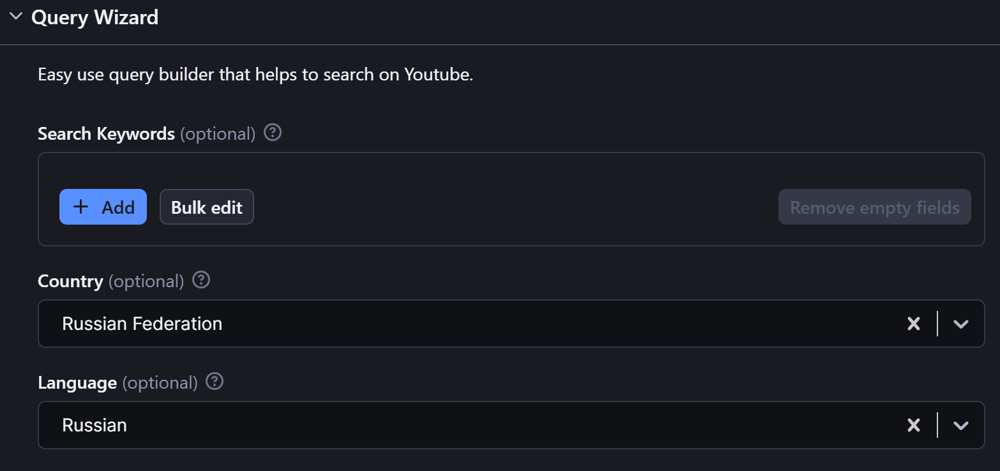

# apify

DOC: [APIFY DOC](https://docs.apify.com/api/client/python/docs)

## 图形界面

store 里面有各种各样的actors： 


选择需要的actor，配置之后进行scrape：

### tweets scraper
大概看了一下这个actor的input参数比较齐全


在[tweet-scraper DOC](https://apify.com/apidojo/tweet-scraper)input参数的解释，
比如如果想爬取俄语帖子，只需要选择：,
或者配置：`"tweetLanguage": "ru"`

点击 save and start 后等待actor 爬完就能看到output：

或者JSON:
```
[
    {
        "url": "https://x.com/izvoity/status/1865184441049440713",
        "twitterUrl": "https://twitter.com/izvoity/status/1865184441049440713",
        "id": "1865184441049440713",
        "text": "@alinaprekrati хорошая у вас компания, раз офис приятней, чем дом",
        "retweetCount": 0,
        "replyCount": 0,
        "likeCount": 0,
        "quoteCount": 0,
        "createdAt": "Fri Dec 06 23:59:58 +0000 2024",
        "bookmarkCount": 0,
        "isRetweet": false,
        "isQuote": false
    },
    {
        "url": "https://x.com/DruzheKarlik/status/1865184440994939391",
        "twitterUrl": "https://twitter.com/DruzheKarlik/status/1865184440994939391",
        "id": "1865184440994939391",
        "text": "@hay_girls1 це ми любимо",
        "retweetCount": 0,
        "replyCount": 0,
        "likeCount": 3,
        "quoteCount": 0,
        "createdAt": "Fri Dec 06 23:59:58 +0000 2024",
        "bookmarkCount": 0,
        "isRetweet": false,
        "isQuote": false
    },
    ...
]
```

### YouTube scraper
doc: [YouTube scraper](https://apify.com/apidojo/youtube-scraper)

操作流和上面一样，
提供Search Keywords，设置目标语言：


#### Output

```
[
    {
        "type": "video",
        "id": "j2uey_I1ajw",
        "title": "Владимир Путин: \"Зря вы хрюкаете\"",
        "url": "https://www.youtube.com/watch?v=j2uey_I1ajw",
        "description": "Подписывайтесь на Telegram-канал ТНВ: https://t.me/tnvtv\nВступайте в группу   / tvtnv  \nСсылка на видео:\n\nВ рамках проекта \"20 вопросов Владимиру Путину\" журналист ТАСС Андрей Ванденко говорил с президентом России на разные темы. Финальная серия была посвящена семье, личным потерям, мечтам и философским мыслям Путина.\n\nВанденко поинтересовался: а для внуков Путин является примером?\n\n\"Они ещё маленькие\", - ответил президент, а дальше продолжил ответ, рассказывая о внуке одной из дочерей. Чтобы проиллюстрировать, как именно складываются отношения в семье.\n\nВанденко прервал Путина и спросил, о какой именно дочке идёт речь. И получил ответ:\n\nКакая разница? - спросил Путин.\nОй, кхм-кхм...\nЗря вы хрюкаете, потому что...\nНе хрюкаю, а покашливаю, - нашёлся Ванденко, вновь перебив Путина.\n\n\"Тем более. Покашливать нечего. Вы же не живёте моей жизнью, и вы не понимаете, что такое вопросы безопасности. Просто человек, когда далёк от этого, он этого просто не замечает. Ну так вот, когда дочка начала учить одного из моих внуков, он говорит: почему я должен делать так, как ты? Она говорит: потому что я старше. Он говорит: нет, дедушка Вова старше. Так что в известной степени, наверное, тоже для них пока - пока, во всяком случае, являюсь таким авторитетом\", - заявил Путин. \n\nНовости партнёров\n\n\n \n \nВаш комментарий\nЮрий Ан\n13 ч\n \nПрезидент позволил себе на мгновение расслабиться и выразить своё истинное отношение и оценку данному субъекту.И поделом,чтобы не забывался.Панибратское отношение  президенту недопустимо,этого не позволяют себе и более… Читать ещё\n \nЕщё 5 ответов из 15\nсерега ш.\n1 ч\n \nЕдинственный вопрос который меня интересует для ВВП .\" Все Ваши близкие родственники проживают в стране которой Вы руководите , имеют одно гражданство и это не влияет на Ваши решения ?\n \nЕщё 1 ответ из 1\nИван Ф\n5 ч\n \nВладимир Владимирович опытный политик. И конечно, журналисту, даже опытному и нахрапистому, не удастся узнать от него больше, чем Путин хочет сказать.\n \nЕщё 1 ответ из 1\nЕщё 10 комментариев из 27\n\n\n\n📱 Вступайте в наш паблик Вконтакте https://vk.com/tatarstan_tnv\n📷 Подписывайтесь на новостной Инстаграм   / newstnv  \n☎ Есть новость? Пишите по номеру What's App: +7(987)420-01-01\n\nПодписывайтесь на ТНВ:    / tnvtv  \n\nТНВ в социальных сетях:\n→ Официальный сайт: http://tnv.ru/\n→ Telegram: https://t.me/tnvtv\n→ Instagram NewsTNV:   / newstnv  \n→ Facebook:   / tvtnv  \n→ Facebook:   / tvtnv  \n→ Вконтакте: https://vk.com/tatarstan_tnv\n→ Вконтакте Sport Stream TNV: https://vk.com/sportstreamtnv\n→ Одноклассники: https://ok.ru/tnvtv \n→ Twitter:   / tnv_tv   \n→ Дзен: https://zen.yandex.ru/tnv\n\nПлейлисты для просмотра:\n→ Новости дня:    • НОВОСТИ ДНЯ | ТНВ 2017 - 2019  \n→ Новости Татарстана. Итоговые выпуски:    • НОВОСТИ ТАТАРСТАНА  \n→ 7 дней:    • 7 Дней 19/03/17  \n→ Вызов 112:    • ВЫЗОВ 112  \n→ Чёрное озеро:    • ЧЕРНОЕ ОЗЕРО  \n\n#НовостиТатарстана #НовостиКазани #Новости\n#ТНВ #КаналТНВ #НовостиРТ #Казань #ТелерадиокомпанияНовыйВек #ТНВПланета\n#Татарстан #РеспубликаТатарстан #ТНВТатарстан\n#ГлавныеНовостиРеспублики #ГлавныеНовостиТатарстана \n\nВедущие программы \"Новости Татарстана\": \nАлексей Калиничев, Даяна Саитова\n\nКоординаты: \n☎ +7 (843) 570-50-17, +7 (843) 570-50-22, +7 (843) 570-50-23\nE-mail: tnvnews@mail.ru\n\nПо вопросам производства видеопродукции \nи трансляции рекламы обращайтесь \nв коммерческий департамент АО «ТРК «Новый Век».\nКоординаты: \n☎ +7 (843) 5 - 705 -100\nE-mail: markettnv@gmail.com",
        "duration": 34,
        "views": 598630,
        "likes": 6401,
        "channel.id": "UCRZoU5z1CS38bDWGuNefo-g",
        "channel.name": "ТНВ",
        "channel.url": "http://www.youtube.com/@tnvtv",
        "streamingData.expiresInSeconds": "2024-12-06T21:28:27.400Z",
        "keywords": [
            "ТНВ",
            "Телерадиокомпания Новый Век",
            "Новый Век",
            "Главные Новости Татарстана",
            "Татарстан",
            "Республика Татарстан",
            "Казань",
            "новости Татарстана",
            "новости на ТНВ",
            "Казанские новости"
        ],
        "embedUrl": "https://www.youtube.com/embed/j2uey_I1ajw",
        "isFamilySafe": true,
        "publishDate": "Oct 8, 2020",
        "uploadDate": "Oct 8, 2020"
    },
    {
        "type": "video",
        "id": "bServLhB2hk",
        "title": "Владимир Путин ответил на вопрос виртуального «двойника»",
        "url": "https://www.youtube.com/watch?v=bServLhB2hk",
        "description": "Владимир Путин ответил на вопрос виртуального «двойника»\n\nПодпишитесь на канал ⇙\n   / @bakutvru  \n❂❂❂\nTelegram: https://t.me/bakutvru\nFacebook:   / bakutvru  \nInstagram:   / bakutvru  \nTwitter:   / bakutvru  \nTikTok:   / bakutvru  \n❂❂❂\nВидео, транслируемые на Baku TV | RU,  защищены авторским правом от имени компании  ©️\"Baku TV\" LLC\n\n\nВладимир Путин ответил на вопрос виртуального «двойника»\n\n\n#путин #двойник #россия #новости #политика\nВладимир Путин ответил на вопрос виртуального «двойника»",
        "duration": 46,
        "views": 214914,
        "likes": 3092,
        "channel.id": "UCBKOwRdavlxEQSqYLii7ZGQ",
        "channel.name": "Baku TV | RU",
        "channel.url": "http://www.youtube.com/@bakutvru",
        "streamingData.expiresInSeconds": "2024-12-06T21:28:27.475Z",
        "keywords": [
            "Владимир Путин ответил на вопрос виртуального «двойника»",
            "Baku TV | RU",
            "Baku tv Ru",
            "Baku TV novosti",
            "Баку тв ру",
            "новости",
            "последние новости",
            "новости Азербайджана",
            "новости на Русском",
            "novosti na russkom",
            "карабах",
            "азербайджан",
            "баку",
            "azerbaycan",
            "bakutvru",
            "baku tv",
            "news",
            "novosti",
            "baku tv live",
            "Baku TV",
            "Baku tvru",
            "Baku news",
            "Baku TV RU",
            "Baku RU",
            "azerbaijan",
            "putin",
            "путин итоги года 2023",
            "президент россии",
            "двойник путина",
            "сколько двойников у путина",
            "Владимир Путин"
        ],
        "embedUrl": "https://www.youtube.com/embed/bServLhB2hk",
        "isFamilySafe": true,
        "publishDate": "Dec 14, 2023",
        "uploadDate": "Dec 14, 2023"
    }
]
```

## Integrations

可以将actor和其他API integrate，自动化工作流：


## API client


free plan被限制使用API：


控制台输出：`{'noResults': True}`
